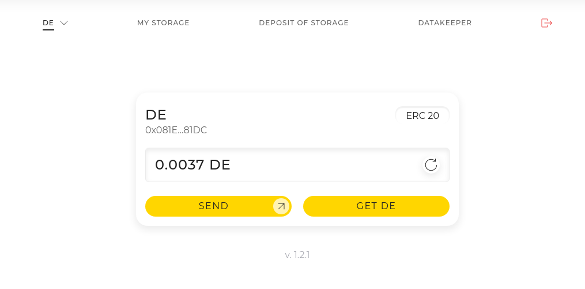
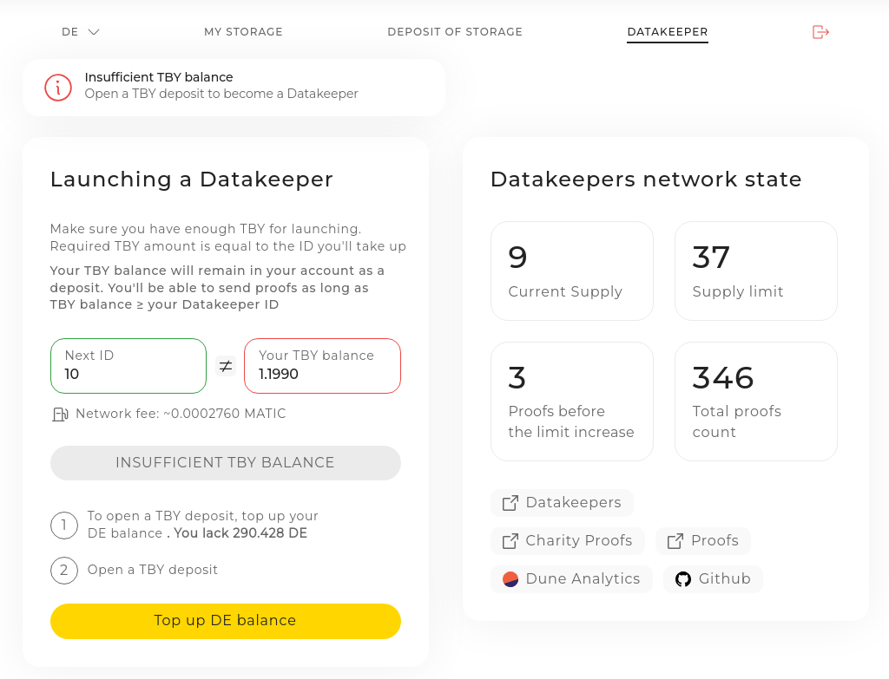

Getting datakeeper ID
===============

This guide shows you how to get a Datakeeper ID in the easiest way possible.\
If you still have questions, ask them in discord or telegram support channels
  
 

## Instruction
1. Go to https://p.denet.app and connect your wallet using metamask or wallet connect. 

2. Select DE in upper left corner:
 

3. Go to "DATAKEEPER" tab:
 

4. Check that you have required amount of TBY to rent a Datakeeper ID. If you don't
    - Top up your DE balance (if you haven't)
     
     

    - Convert DE to TBY (it should be equal or higher than rented node ID)
     
     

5. Rent your datakeeper ID 
 

### Congratulations 🎉
Now you can start your datakeeper, send your first proofs and earn $TBY and $TBYmined as a reward.
  See the installation guides [here](/readme.md#installation).

#### 🪙 Withdraw $TBYmined to $DE token
- use to influence protocol parameters in [Consensus](https://consensus.denet.app/#welcome_to_consensus)
- Use it for your own fate

#### 🪙 Earn $TBY as a system reward from protocol  (2% APY of $TBY total supply)
- use it for storing data
- soon: convert it to $TBYmined using charity proofs. Read how it will work [here](https://medium.com/denetpro/denet-storage-protocol-v3-to-address-key-challenge-of-decentralization-f19b9041b0fa#:~:text=close%20the%20deposit.-,Charity%20Proof,-%3A%20The%20DeNet)

### Also...
#### ❗️ Make sure you always have enough $MATIC on yur balance, in order to send proofs.
#### ❗️ Don't let your $TBY balance become less than your Datakeeper ID, unless you want to stop earning rewards.
