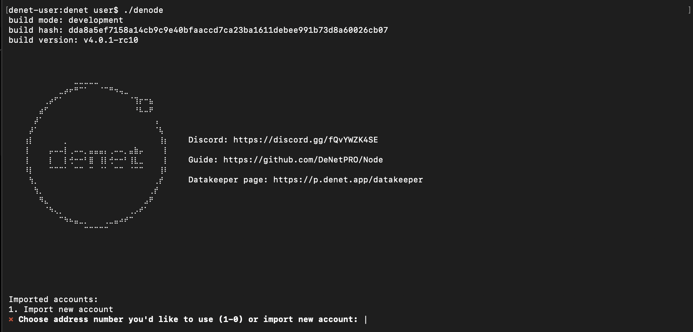
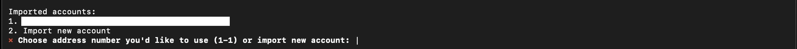
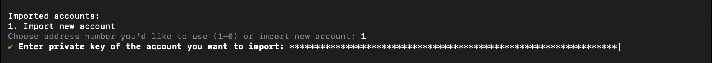
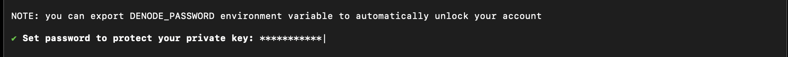
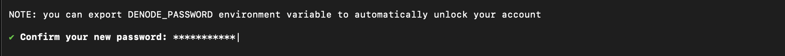
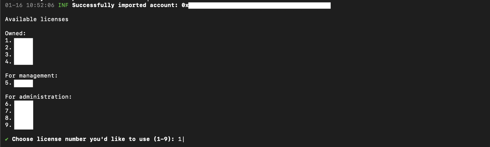
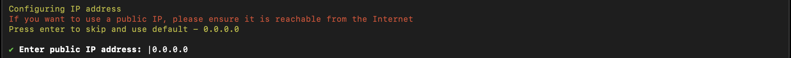
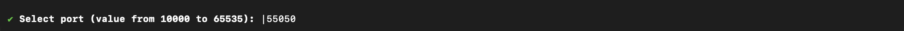
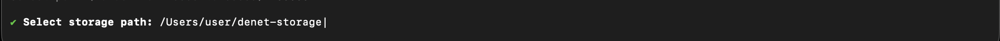
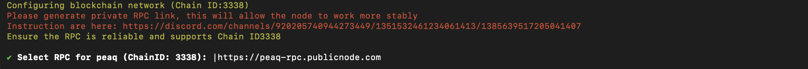

# DeNet Datakeeper Node CLI Configuration

If you see the following window, your node is ready to be configured.

### Follow the instructions in your terminal

1. **Choose the account or import a new one**:
    - To use already imported account: Choose it in the displayed list
    
    - To import: Choose the **import** option and paste the copied [private key](./requirements.md#step-1-copy-your-private-key), then press Enter
    
2. **Set Password**: Enter a strong password
    - The private key will be stored securely on your device, encrypted with this password
    
    
3. **Choose License ID**: enter license number you'd like to start
    - Enter any license number from the **Available licenses** list
    
   > ⚠️ **Important**: Do not choose the same license number when running multiple node instances. This is not prohibited, but it can lead to undefined behavior

   > 💡 **Tip**: If you want to run multiple licenses on the same computer at the same time, you can conveniently do this using the Node Manager desktop application with a graphical interface. [Download now](../readme.md#desktop-node-manager-builds)

4. **Enter IP Address**: Press enter to use the default one (0.0.0.0)
    - If you'd like to set up the [public IP](./public-ip.md), enter it in the following format: xxx.xxx.xxx.xxx
    
5. **Choose Port**: Press Enter to use default one (55050)
    - Or specify another (value from 10000 to 65535)
    - If you use the public IP address, make sure that the port is [forwarded](./public-ip.md#port-forwarding-requirements)
    
6. **Specify Storage Directory**: Enter path to the user files storage
    - **e.g.**, /home/user/denet_storage (Linux/macOS) or C:\denet_storage (Windows)
    - Ensure the directory exists and has sufficient space
    

7. **Set Storage Space**:
    - Specify the amount of disk space to allocate for DeNet Storage (e.g., 10). Enter the value (only number, without GiB) when prompted.
    

8. **Select [RPC](./faq.md#what-is-an-rpc-and-why-do-we-use-it) for peaq Blockchain**: Press Enter to use default one.
    - Or choose the RPC endpoint (Select RPC for peaq (ChainID: 3338)).
    

9. **Verify Operation**:
    - Watch the terminal output. If no errors appear, your DeNet Node is running correctly.
      

**NOTE:**
1. Configuration parameters could be viewed or changed using [CLI config commands](./denode-command.md#config-management-commands)
2. Shared space parameters could be changed using [CLI disks commands](./disks-management.md)
3. To completely reset your configuration and start from scratch, delete the configuration files located at:
    - Linux/macOS: `~/.denode/config-(license-id).json` and `~/.denode/config-(license-id).json.bak`
    - Windows: `%USERPROFILE%\.denode\config-(license-id).json` and `%USERPROFILE%\.denode\config-(license-id).json.bak`
    - Replace `(license-id)` with your actual license number
