# DeNet Datakeeper Node Manager Configuration

## Table of Contents
1. [Account Setup](#account-setup)
2. [Password Configuration](#password-configuration)
3. [Node Activation](#node-activation)
4. [Monitoring Your Node](#monitoring-your-node)

When you first install Node Manager, you will see the following window, which means that you need to configure the environment to run the nodes
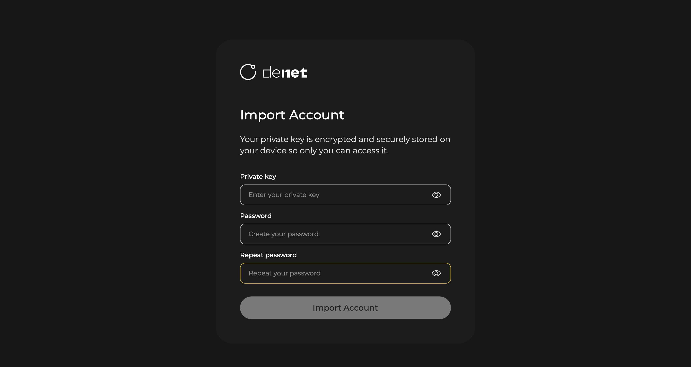

## Account Setup
### Choose the account or import a new one:

- To use already imported account: Choose it in the displayed list
  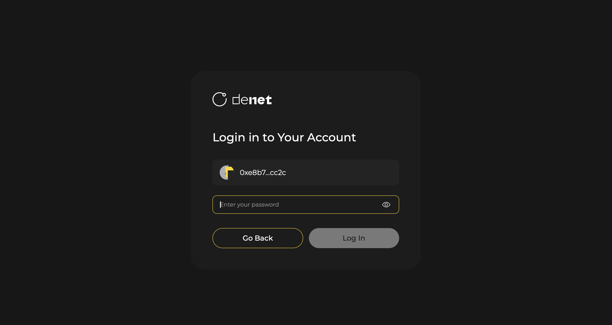
- To import: Choose the **import** option and paste the copied [private key](./requirements.md#step-1-copy-your-private-key), then press Enter
  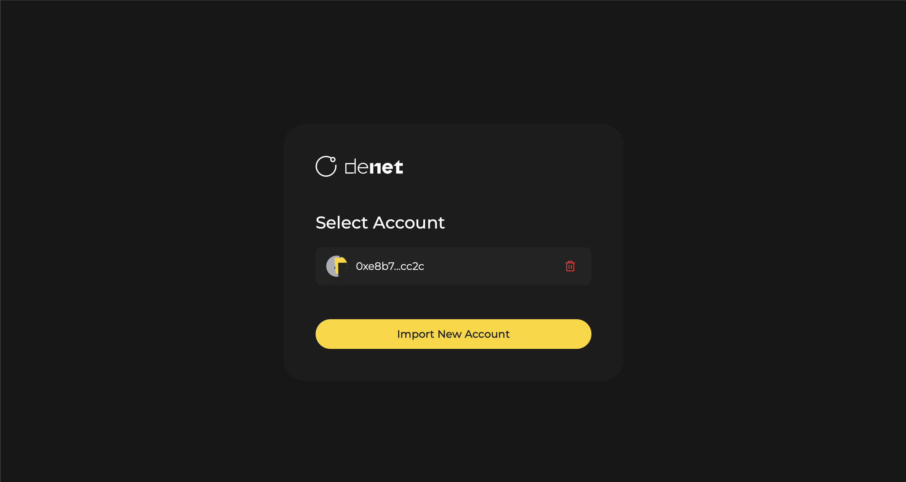

## Password Configuration
### Set Password: Enter a strong password
- The private key will be stored securely on your device, encrypted with this password
  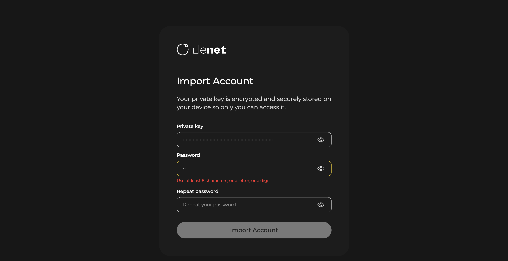
  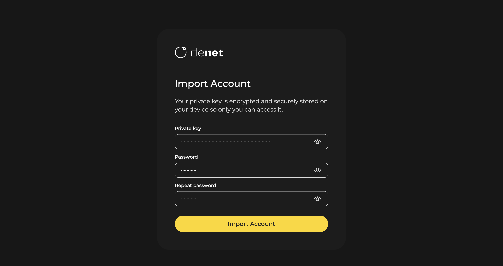

## Node Activation
At startup, all licenses will be disabled
   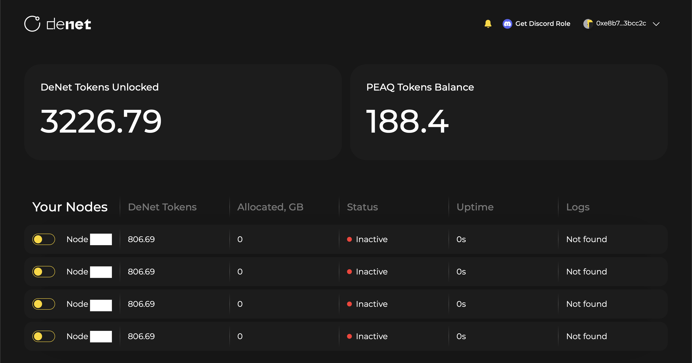
In order to **activate the nodes**, you need to set additional configuration settings for each node:
1. **Choose License ID**: сlick on the toggle to the left of the license number to proceed to the activation
    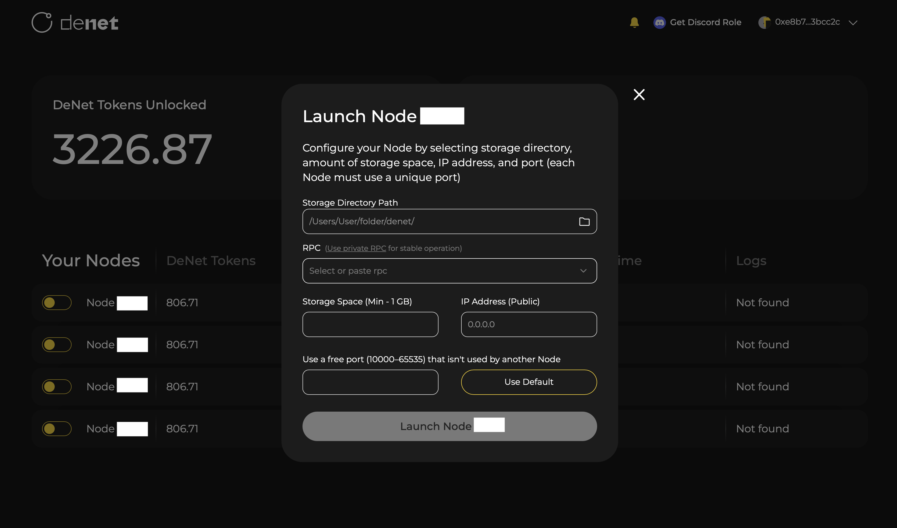
2. **Specify Storage Directory**: Enter path to the directory you would like to share for the storage users data
    - Click on the folder icon on the right to select a directory interactively
    - Or enter the path manually, **e.g.**, /Users/user/denet_storage (Linux/macOS) or C:\denet_storage (Windows)
    - Ensure the directory exists and has sufficient space
    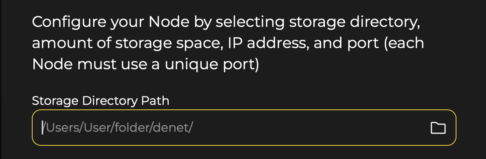
3. **Select [RPC](./faq.md#what-is-an-rpc-and-why-do-we-use-it) for peaq Blockchain (Chain Id: 3338)**
    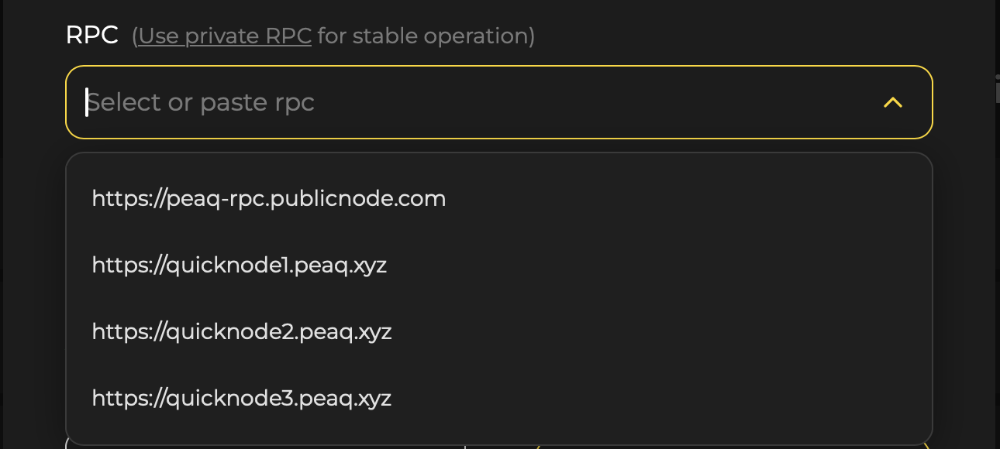
4. **Set Storage Space**:
    - Specify the amount of disk space to allocate for DeNet Storage (e.g., 100). Enter the value (only number, without GiB) when prompted  
    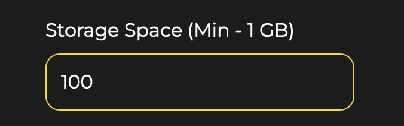
5. **Enter IP Address**: Skip to use the default one (0.0.0.0)
    - If you'd like to set up the [public IP](./public-ip.md), enter it in the following format: xxx.xxx.xxx.xxx  
    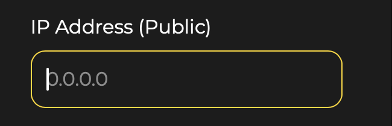
6. **Choose Port**: Press `Use Default` to configure it automatically
    - Or specify another (value from 10000 to 65535)
    - If you use the public IP address, make sure that the port is [forwarded](./public-ip.md#port-forwarding-requirements)
    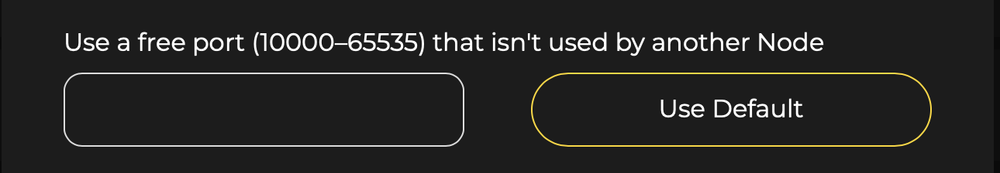

7. **Verify Operation**:
    - If the startup icon turns green, and you receive a [notification](#viewing-notifications) that the node has entered the pool, you can consider it running
    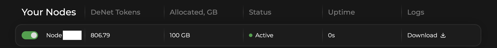
    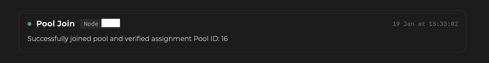

## Monitoring Your Node
### Viewing Notifications
- Some important events are displayed as notifications in the form of a bell in the upper right corner
    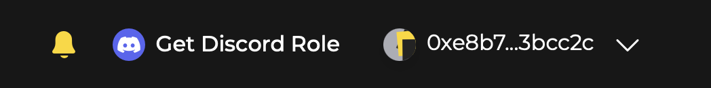
- Check the notification center regularly for any warnings or important messages
### Downloading Logs
- Press `Download` button in Logs section for the license you'd like to monitor the internal logs for
    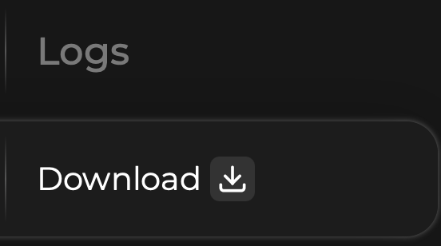
- Save the log files to your preferred location for troubleshooting

### Changing Settings
- Click on the pencil icon to the right of the license which settings you want to change
    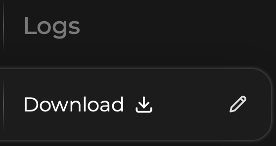
- Change shared directory path, shared space amount or add a new volume
    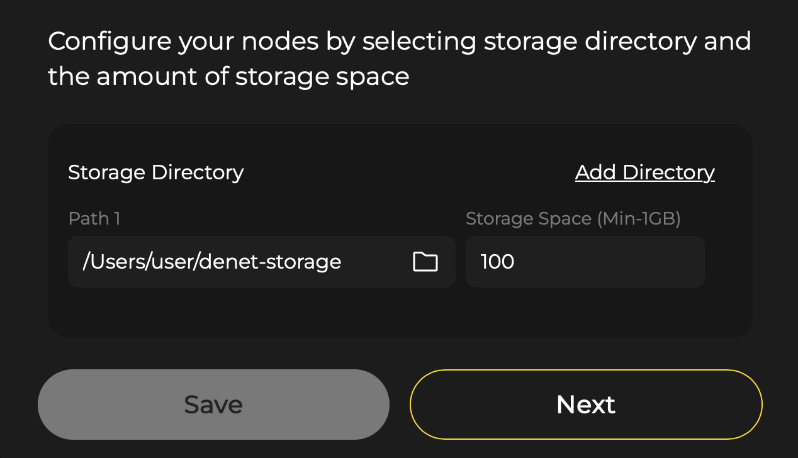
- Click `Next` to edit other settings
    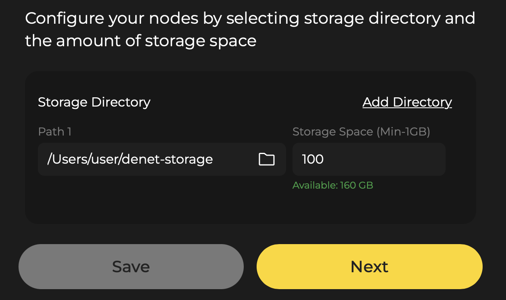
- Modify the desired parameters such as RPC endpoint, storage directory, or port settings
    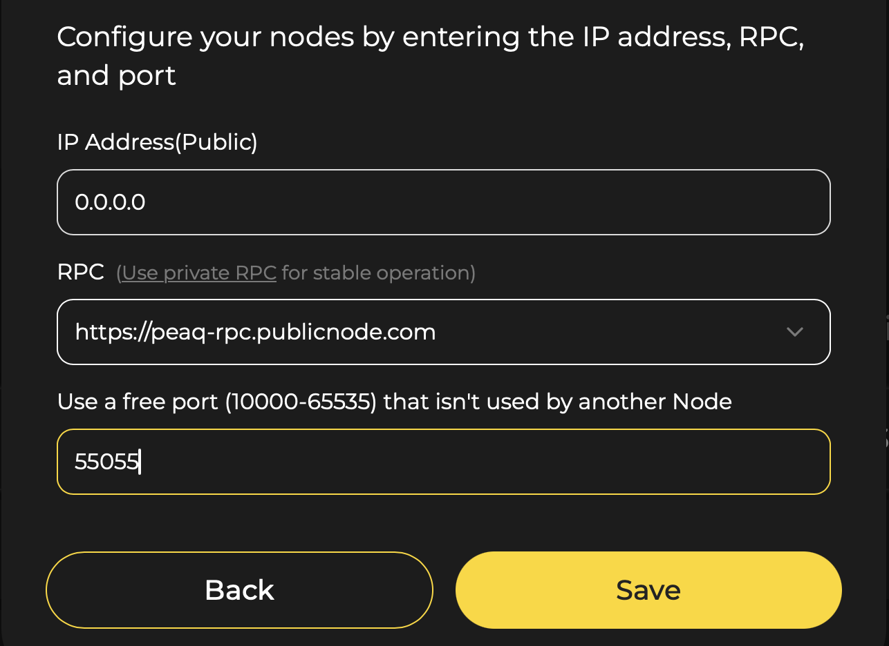
- Save changes to apply them

### Checking Node Status
- The node should display as "Active" in the list of active nodes
- Verify that your node has successfully joined the pool by checking the notifications
- Go to the peaq subscan website to check which transactions the node is sending
    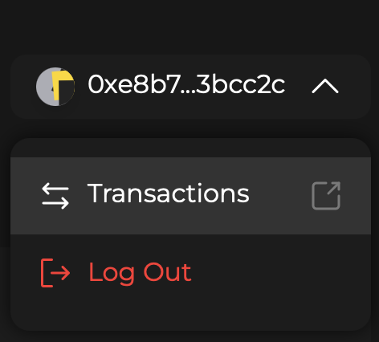
- [Monitor](./monitoring.md) your nodes node state regularly (at least once a day)
