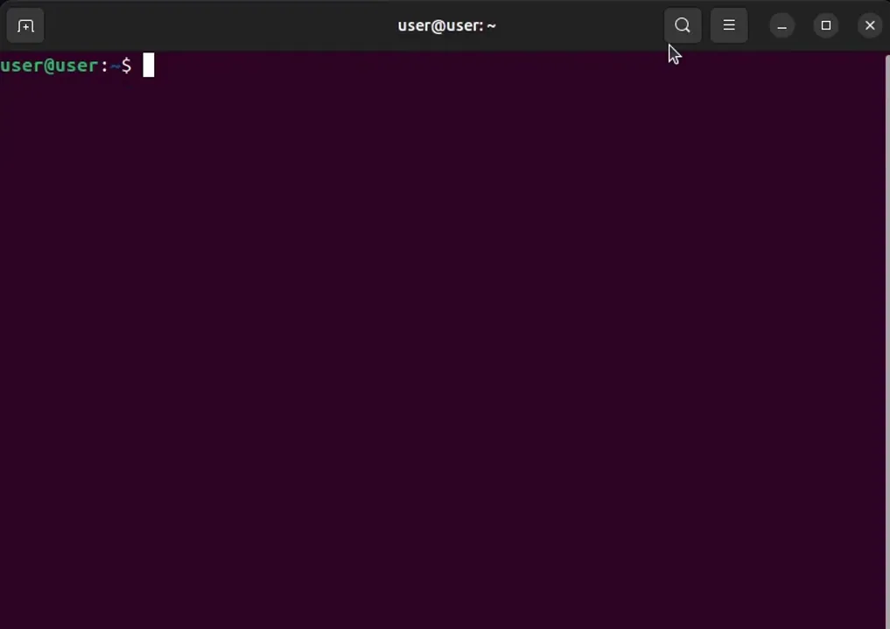
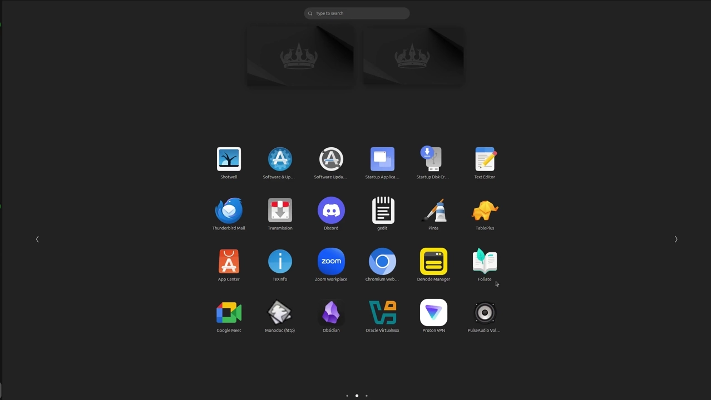

# DeNet Desktop Node Manager Installation Guide for Linux

This guide provides step-by-step instructions for installing and running the DeNet Desktop Node Manager on Linux systems. The Desktop Node Manager offers a user-friendly graphical interface for managing your DeNet Datakeeper nodes.

## Table of Contents

1. [Setup Guide](#setup-guide)
2. [Bonus Guide](#bonus-guide)
3. [Troubleshooting](#troubleshooting)
4. [Additional Resources](#additional-resources)

---

## Setup Guide

> ⚠️ **Important:** Before starting, please review the [System and Account Requirements](./requirements.md) to ensure you have everything needed.

### Step 0: Download

Choose one of the following methods to download the Desktop Node Manager:

#### **Method 1: Direct Download from GitHub (Recommended)**

1. Visit the [DeNet Node Releases page](https://github.com/DeNetPRO/Node/releases/latest)
2. Download the appropriate version for your Linux distribution:
   - **Debian/Ubuntu (x86_64):** `DeNode_Manager_1.0.5_amd64.deb`
   - **Debian/Ubuntu (ARM64):** `DeNode_Manager_1.0.5_arm64.deb`
   - **Red Hat/Fedora/CentOS (x86_64):** `DeNode_Manager-1.0.5-1.x86_64.rpm`
   - **Red Hat/Fedora/CentOS (ARM64):** `DeNode_Manager-1.0.5-1.aarch64.rpm`

#### Method 2: Using Terminal

Open Terminal and run the appropriate command for your distribution:

```bash
# For Debian/Ubuntu (AMD64)
curl -LO https://github.com/DeNetPRO/Node/releases/download/v4.0.1-rc11/DeNode_Manager_1.0.5_amd64.deb

# For Debian/Ubuntu (ARM64)
curl -LO https://github.com/DeNetPRO/Node/releases/download/v4.0.1-rc11/DeNode_Manager_1.0.5_arm64.deb

# For Red Hat/Fedora/CentOS (AMD64)
curl -LO https://github.com/DeNetPRO/Node/releases/download/v4.0.1-rc11/DeNode_Manager-1.0.5-1.x86_64.rpm

# For Red Hat/Fedora/CentOS (ARM64)
curl -LO https://github.com/DeNetPRO/Node/releases/download/v4.0.1-rc11/DeNode_Manager-1.0.5-1.aarch64.rpm
```

### Step 1: Installation

#### Install the Package

**For Debian/Ubuntu (DEB):**

```bash
# Install the package
sudo dpkg -i DeNode_Manager_1.0.5_amd64.deb

# Fix missing dependencies
sudo apt install -f
```

**For Red Hat/Fedora/CentOS (RPM):**

```bash
# Install the package
sudo rpm -ivh DeNode_Manager-1.0.5-1.x86_64.rpm
```



### Step 2: Launch

**From Applications Menu:**

1. Open your applications menu
2. Find **DeNode Manager** in the list
3. Click to launch

**From Terminal:**

```bash
denode-manager
```



After authorization, you will see a list of licenses associated with your wallet. Initially, all licenses will be disabled until configured.

> 💡 **Tip:** The first launch may take some time as the application initializes its components.

### Step 3: Configure Your Node

Learn how to configure and activate your node:
- [Configuring Node Manager Guide](./configuring-manager.md)

---

## Bonus Guide

Congratulations! You have successfully installed and launched the DeNet Desktop Node Manager. Here are some bonus resources to enhance your experience:

### 1. Monitor Your Node

Learn how to monitor node activity and performance:
- [Node Activity Monitoring](./monitoring.md)

### 2. Manage Your License

Understand license management and transactions:
- [License Management](./license-management.md)

### 3. Set Up Public IP (Optional)

Improve node performance with a public IP address:
- [Public IP Setup Guide](./public-ip.md)

---

## Troubleshooting

Contact support if you encounter issues:
- [Discord Support](https://discord.gg/cPz9m4cSWv)

---

## Additional Resources

### Documentation

- [FAQ - Frequently Asked Questions](./faq.md)
- [Command Line Interface Guide](./denode-command.md)
- [Disk Management Guide](./disks-management.md)

### Installation Guides for Other Platforms

- [Windows Installation](./install-denode-manager-windows.md)
- [macOS Installation](./install-denode-manager-macos.md)

### Community & Support

- **Official Website:** [denet.pro](https://denet.pro)
- **Discord Server:** [Join our community](https://discord.gg/cPz9m4cSWv)

**Need Help?**  
If you encounter any issues not covered in this guide, please reach out through our community channels:
- [Discord Support](https://discord.gg/cPz9m4cSWv)
