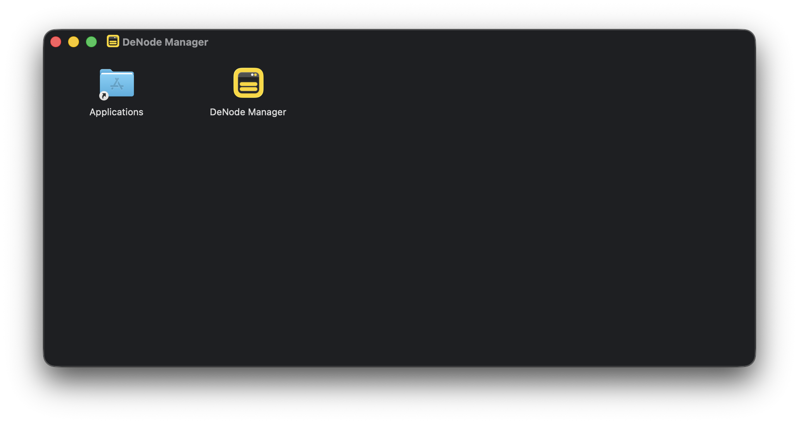
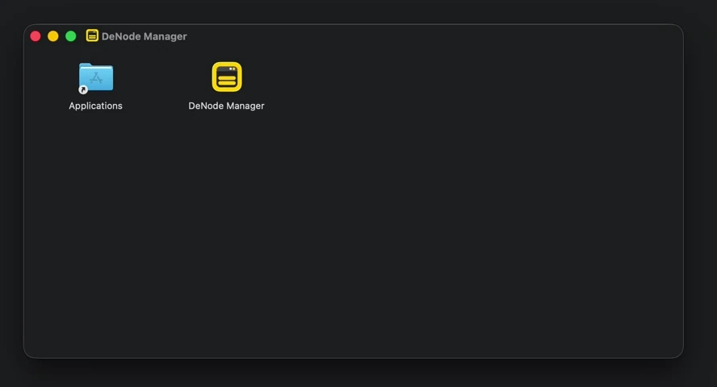
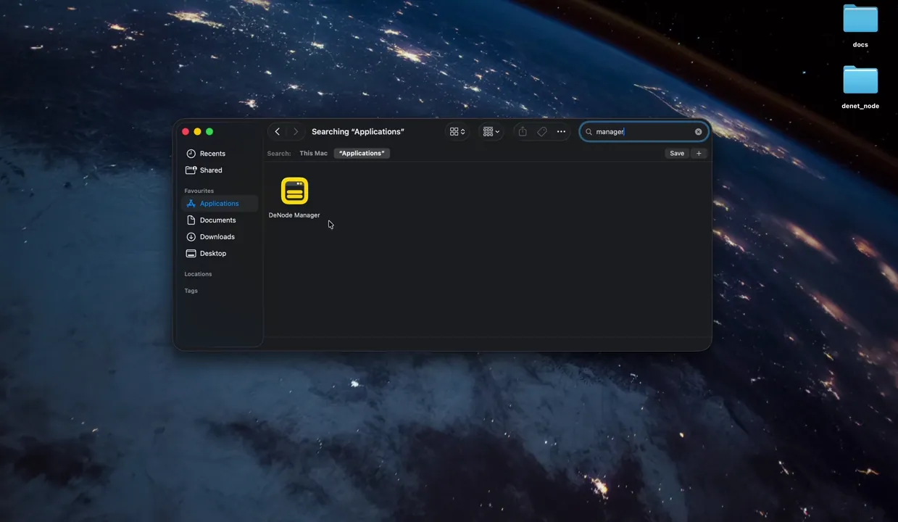

# DeNet Desktop Node Manager Installation Guide for macOS

This guide provides step-by-step instructions for installing and running the DeNet Desktop Node Manager on macOS systems. The Desktop Node Manager offers a user-friendly graphical interface for managing your DeNet Datakeeper nodes.

## Table of Contents

1. [Setup Guide](#setup-guide)
2. [Next Steps](#next-steps)
3. [Troubleshooting](#troubleshooting)
4. [Additional Resources](#additional-resources)

---

## Setup Guide

> ⚠️ **Important:** Before starting, please review the [System and Account Requirements](./requirements.md) to ensure you have everything needed.

### Step 0: Download

Choose one of the following methods to download the Desktop Node Manager:

#### Method 1: Direct Download from GitHub (Recommended)

1. Visit the [DeNet Node Releases page](https://github.com/DeNetPRO/Node/releases/latest)
2. Download the macOS version:
   - **macOS (Intel/Apple Silicon):** `DeNode_Manager_1.0.5_x64.dmg`

#### Method 2: Using Terminal

Open Terminal and run:

```bash
curl -LO https://github.com/DeNetPRO/Node/releases/download/v4.0.1-rc11/DeNode_Manager_1.0.5_x64.dmg
```

#### Verify Download (Optional)

```bash
# Check if the file downloaded successfully
ls -lh ~/Downloads/DeNode_Manager*.dmg
```

### Step 1: Installation

#### Open the DMG File

Navigate to your Downloads folder and double-click the `.dmg` file:

```bash
# Or open from Finder
open ~/Downloads/DeNode_Manager*.dmg
```



A window will appear showing the DeNode Manager application icon and the Applications folder shortcut.

#### Drag to Applications Folder

Drag the **DeNode Manager** icon into the **Applications** folder shortcut in the installation window.



Wait for the copy process to complete. This may take some time depending on your Mac's performance.

> 💡 **Tips:** After copying, you can eject the disk image (drag to Trash or right-click → Eject) and delete the `.dmg` file to free up space, or keep it for future reinstallations.

### Step 2: Launch

#### Open the Application and View Initial Screen

1. Open **Finder** → **Applications**
2. Find **DeNode Manager** in your Applications folder
3. Double-click to launch

Alternatively, use Spotlight:
```bash
open -a "DeNode Manager"
```

On first launch, macOS will confirm that the app is verified by Apple, and you will see the initial configuration screen:



After authorization, you will see a list of licenses associated with your wallet. Initially, all licenses will be disabled until configured.

> 💡 **Tip:** The first launch may take some time as the application initializes its components.

---

## Next Steps

Congratulations! You have successfully installed and launched the DeNet Desktop Node Manager. Here's what to do next:

### 1. Configure Your Node

Learn how to configure and activate your node:
- [Configuring Node Manager Guide](./configuring-manager.md)

### 2. Monitor Your Node

Learn how to monitor node activity and performance:
- [Node Activity Monitoring](./monitoring.md)

### 3. Manage Your License

Understand license management and transactions:
- [License Management](./license-management.md)

### 4. Set Up Public IP (Optional)

Improve node performance with a public IP address:
- [Public IP Setup Guide](./public-ip.md)

---

## Troubleshooting

Contact support if you encounter issues:
- [Discord Support](https://discord.gg/cPz9m4cSWv)

---

## Additional Resources

### Documentation

- [FAQ - Frequently Asked Questions](./faq.md)
- [Command Line Interface Guide](./denode-command.md)
- [Disk Management Guide](./disks-management.md)

### Community & Support

- **Official Website:** [denet.pro](https://denet.pro)
- **Discord Server:** [Join our community](https://discord.gg/cPz9m4cSWv)

### Installation Guides for Other Platforms

- [Windows Installation](./install-denode-manager-windows.md)
- [Linux Installation](./install-denode-manager-linux.md)

**Need Help?**  
If you encounter any issues not covered in this guide, please reach out through our community channels:
- [Discord Support](https://discord.gg/cPz9m4cSWv)
