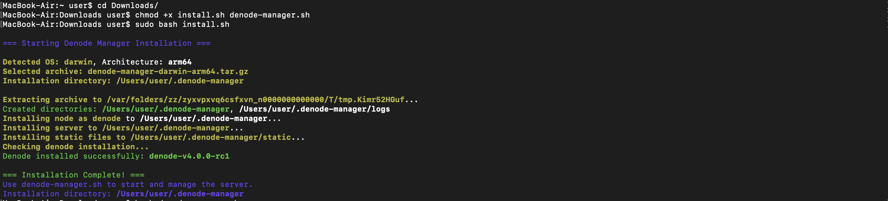
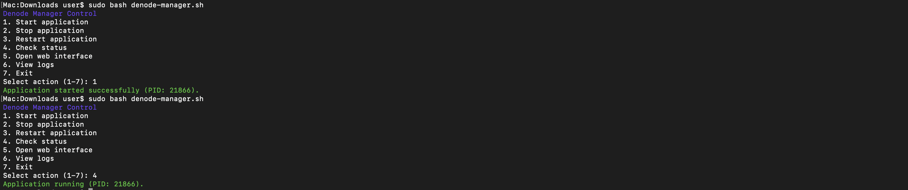
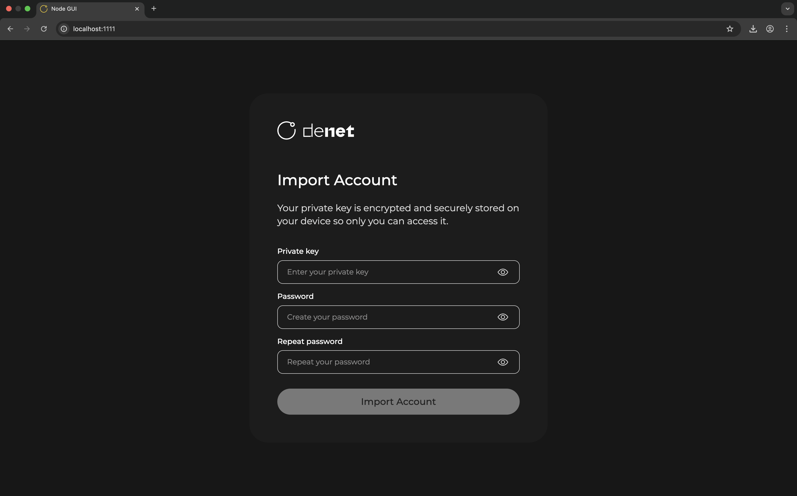

# DeNode Manager Web for Linux

## Installation Guide

### Step 0: Prepare Environment
1. Download installation and management scripts from the [scripts](https://github.com/DeNetPRO/Node/tree/Dev/scripts) directory
    ```shell
    install.sh
    denode-manager.sh
    ```

### Step 1: Download Application
1. Download the appropriate archive for your system from https://github.com/DeNetPRO/Node/releases
   ### Linux
    ```
    denode-manager-linux-amd64.zip
    denode-manager-linux-arm64.zip
    ```

### Step 2: Install And Run
1. Open terminal
2. Allow scripts execution on this device
    ```shell
    cd ~/Downloads
    chmod +x install.sh denode-manager.sh
    ```
3. Run installation script that will install the application in ~/.denode-manager by default
    ```shell
   sudo bash install.sh
   ```
   
4. Then start the application and check its state using ***denode-manager.sh*** script
    ```shell
   sudo bash denode-manager.sh
   ```
   

### Step 3: Open Application Interface in Browser
1. Open browser and go to http://localhost:1111
   

## Notes:
1. Launched server should always be running in the background, otherwise the application will not work, check the status using ***denode-manager.sh*** script
2. You shouldn't use both CLI and GUI at the same time, otherwise you will get an undefined application behaviour
