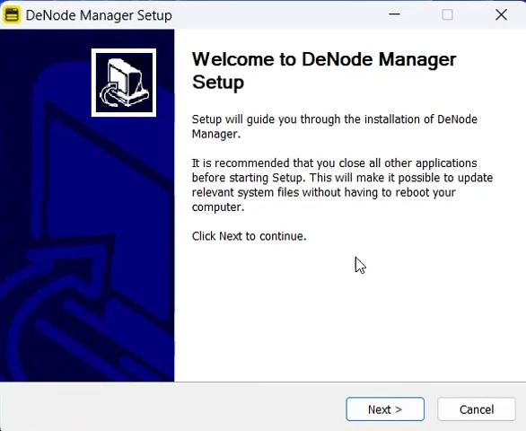
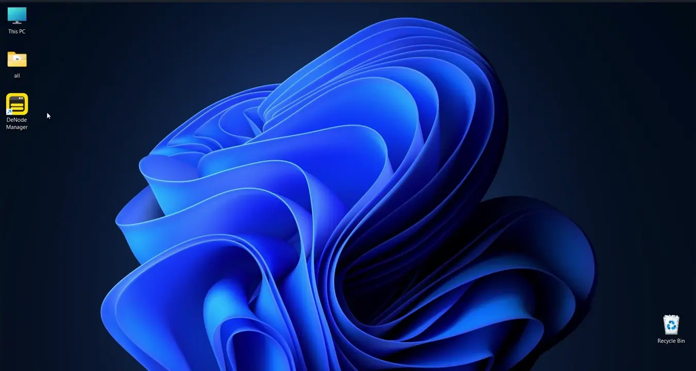

# DeNet Desktop Node Manager Installation Guide for Windows

This guide provides step-by-step instructions for installing and running the DeNet Desktop Node Manager on Windows systems. The Desktop Node Manager offers a user-friendly graphical interface for managing your DeNet Datakeeper nodes.

## Table of Contents

1. [Setup Guide](#setup-guide)
2. [Bonus Guide](#bonus-guide)
3. [Troubleshooting](#troubleshooting)
4. [Additional Resources](#additional-resources)

---

## Setup Guide

> ⚠️ **Important:** Before starting, please review the [System and Account Requirements](./requirements.md) to ensure you have everything needed.

### Step 0: Download

Choose one of the following methods to download the Desktop Node Manager:

#### Method 1: Direct Download from GitHub (Recommended)

1. Visit the [DeNet Node Releases page](https://github.com/DeNetPRO/Node/releases/latest)
2. Download the Windows version:
   - **Windows (x86_64):** `DeNode_Manager_1.0.5_x64-setup.exe`

---

### Step 1: Installation

#### Open the Installer

1. Navigate to your Downloads folder
2. Double-click `DeNode_Manager_1.0.5_x64-setup.exe`
3. If prompted by User Account Control, click **Yes** to allow the installation

#### Follow the Installation Wizard

1. Click **Next** on the welcome screen
2. Choose the installation location (default is recommended)
3. Click **Install** to begin the installation
4. Wait for the installation to complete an click **Finish** to exit the wizard
5. Optionally, check "Launch DeNode Manager" to start the application immediately

> 💡 **Tips:** 
> - The installer will create a Start Menu shortcut and optionally a Desktop shortcut
> - You can change the installation location if needed, but the default `C:\Program Files\DeNode Manager` is recommended

### Step 2: Launch

#### Open the Application and View Initial Screen

**From Start Menu:**
1. Click the **Start** button
2. Find **DeNode Manager** in the application list
3. Click to launch

**From Desktop:**
1. Double-click the **DeNode Manager** shortcut on your Desktop (if created during installation)

**From Installation Folder:**
1. Navigate to `C:\Program Files\DeNode Manager`
2. Double-click `DeNode Manager.exe`

After authorization, you will see a list of licenses associated with your wallet. Initially, all licenses will be disabled until configured.

> 💡 **Tip:** The first launch may take some time as the application initializes its components.

### Step 3: Configure Your Node

Learn how to configure and activate your node:
- [Configuring Node Manager Guide](./configuring-manager.md)

---

## Bonus Guide

Congratulations! You have successfully installed and launched the DeNet Desktop Node Manager. Here are some bonus resources to enhance your experience:

### 1. Monitor Your Node

Learn how to monitor node activity and performance:
- [Node Activity Monitoring](./monitoring.md)

### 2. Manage Your License

Understand license management and transactions:
- [License Management](./license-management.md)

### 3. Set Up Public IP (Optional)

Improve node performance with a public IP address:
- [Public IP Setup Guide](./public-ip.md)

---

## Troubleshooting

Contact support if you encounter issues:
- [Discord Support](https://discord.gg/cPz9m4cSWv)

---

## Additional Resources

### Documentation

- [FAQ - Frequently Asked Questions](./faq.md)
- [Command Line Interface Guide](./denode-command.md)
- [Disk Management Guide](./disks-management.md)

### Community & Support

- **Official Website:** [denet.pro](https://denet.pro)
- **Discord Server:** [Join our community](https://discord.gg/cPz9m4cSWv)

### Installation Guides for Other Platforms

- [macOS Installation](./install-denode-manager-macos.md)
- [Linux Installation](./install-denode-manager-linux.md)

---

**Need Help?**  
If you encounter any issues not covered in this guide, please reach out through our community channels:
- [Discord Support](https://discord.gg/cPz9m4cSWv)
