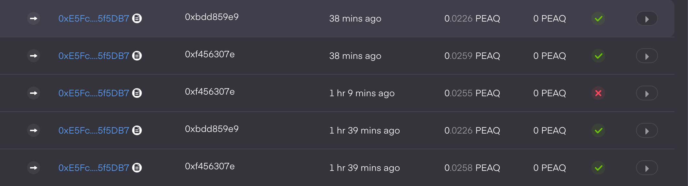
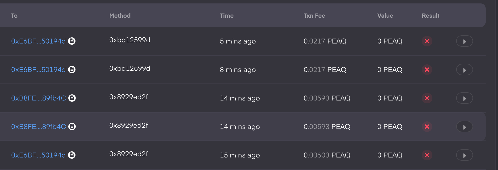
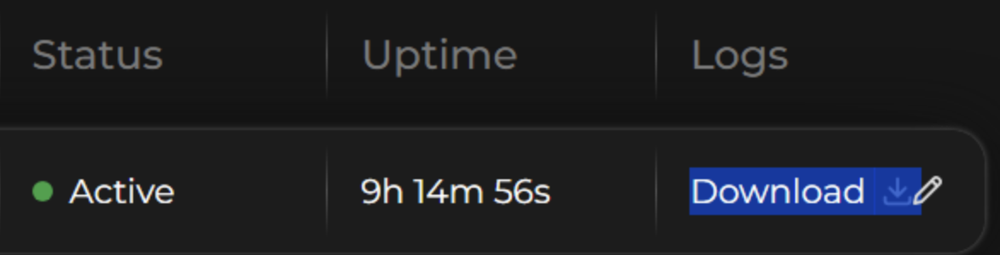
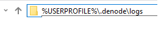

# How To Monitor Your Node State

## Overview

Monitoring your node's activity is crucial to ensure it's functioning correctly and processing data as expected. This guide will walk you through checking transactions and locating node logs.

## Step 1: Check Transactions

Track your node's activity using the peaq Subscan web interface.

### Steps:

1. Visit the peaq Subscan website (e.g., https://peaq.subscan.io/account/YOUR_ADDRESS)
2. Search for your node's transactions using your Datakeeper address
3. Check transaction statuses:
    - Green check marks indicate successful transactions, confirming your node is working correctly
    - Regular and stable transactions confirm proper node operation

### Transaction Status Indicators

#### ✅ Successful Transactions
Green check marks indicate successful transactions  


> 💡 **Note**: There should be 2 Proof of Storage regular transactions for every running node, one confirms data storage of the whole node file system and another one makes a specific user data snapshot.

#### ⚠️ Single Errors
Occasional single errors are normal - don't worry if previous and subsequent transactions are successful  


#### ❌ Multiple Errors
If you see several errors in a row, contact [support](https://discord.com/channels/920205740944273449/1341396814502559846) with Node [logs](#log-file-information)  


## Step 2: Locate Node Logs

### Method 1: Using Node Manager Graphical Interface
First way is using the [Node Manager](../readme.md#desktop-node-manager-builds) application by clicking the Download button  


### Method 2: File System Explorer

#### Windows:
You can find your node logs by entering this line in Windows Explorer:
```
%USERPROFILE%\.denode\logs
```


You'll see log files named after your license numbers.

#### Linux and macOS:
Node logs are located at:
```
~/.denode/logs
```

### Method 3: CLI Users

Screenshot the latest logs or a particular errors from your terminal.

### Log File Information

- Log files are named according to your license numbers
- These logs contain detailed information about node operations and any errors that occurred
- Review logs regularly to identify potential issues before they become critical

## Troubleshooting Tips

- Regular transaction monitoring helps identify issues early
- Keep an eye on transaction frequency and success rates
- If you notice persistent errors, consult the logs for detailed error messages
- Contact [support](https://discord.com/channels/920205740944273449/1341396814502559846) with logs when experiencing multiple consecutive transaction failures
