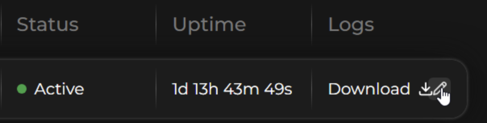
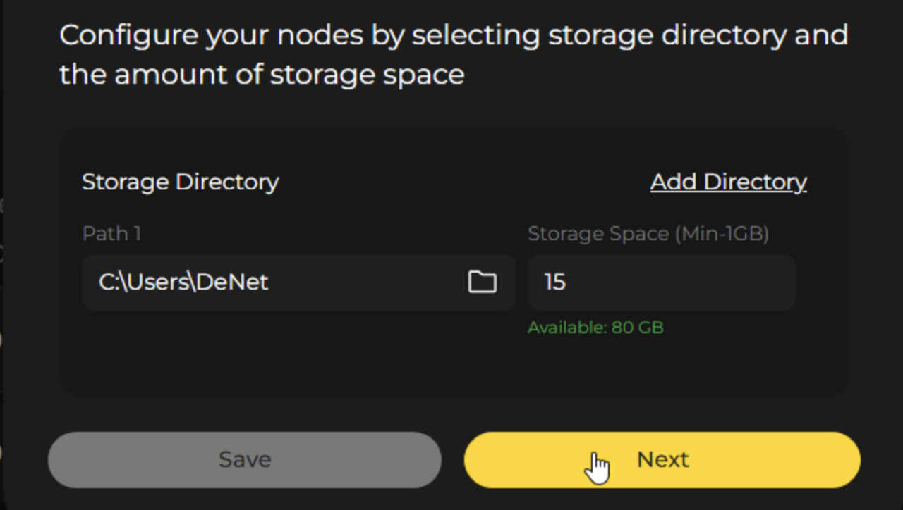
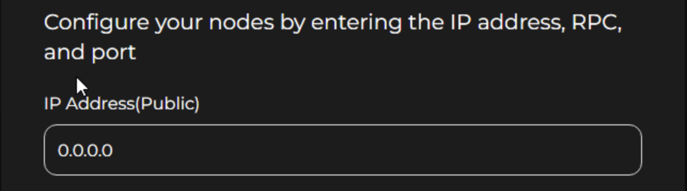

# Public IP Guide

## Table of Contents
- [What is a Public (White) IP and Why Does It Matter?](#what-is-a-public-white-ip-and-why-does-it-matter)
- [Why a Public IP is Important for a Node](#why-a-public-ip-is-important-for-a-node)
- [Benefits of Public IP for Nodes](#benefits-of-public-ip-for-nodes)
- [Impact on Node Pool Performance](#impact-on-node-pool-performance)
- [How to Get a Public IP Address](#how-to-get-a-public-ip-address)
- [Port Forwarding Requirements](#port-forwarding-requirements)
- [Is a Public IP Required?](#is-a-public-ip-required)
- [Setting Up Your Node with Public IP](#setting-up-your-node-with-public-ip)

## What is a Public (White) IP and Why Does It Matter?

A public IP address is a unique, globally accessible identifier for a device on the internet. Think of it as your home's street address: it allows others to find and communicate with you directly.

Most users operate behind a private (gray) IP, shielded by Network Address Translation (NAT). This is like living in an apartment building without a public mailbox—your device can send data out, but incoming connections rely on intermediaries like routers to forward traffic.

With a public IP, your node (server) becomes directly reachable, bypassing the need for middlemen.

### Why is this important?

- ✅ Enables direct, peer-to-peer connections with other nodes
- ✅ Ensures faster, more reliable data transfers
- ✅ Eliminates dependency on relays or tunnels
- 🚀 When traffic payments are introduced, nodes with public IPs will earn higher rewards, as they handle traffic

> ⬇️ We'll soon share how a public IP impacts a Node Pool and guide you on how to get one.

## Why a Public IP is Important for a Node

In our network, each pool consists of 32 nodes working together. For a node to fully participate — receiving files from businesses or users and sending them back — it needs to be reachable from the outside.

Here's how it works:

**✅ With a public IP** → the node can accept connections directly. This means faster response times, fewer failures, and smoother data flow.

**⚪ With a private (gray) IP** → the node cannot be reached directly. Instead, it must connect through another node that has a public IP. That node acts as a gateway, creating a tunnel to forward the data back and forth.

This setup works, but it introduces extra steps and can reduce efficiency.

## How to Get a Public IP Address

One of the most common and reliable ways to obtain a public IP address is directly from your Internet Service Provider (ISP). Many Internet service providers around the world offer this option as an addition to your data plan.

### Step 1. Contact your provider

Contact customer support (by phone, live chat, or email).

Ask if they provide a static public IP address or a dedicated IP address.

In many countries, this is a standard service, sometimes a small monthly fee is charged for it.

### Step 2. Activate the service

As soon as your Internet service provider turns on the public IP, this new address will be used on your internet connection.

You can confirm this by visiting [whatismyip.com](https://whatismyip.com) or [ipinfo.io](https://ipinfo.io).

### Step 3. Open the port (for your node)

Your node needs an open port so that it can communicate with the outside world. For example, let's say we want to open port 8080:

1. Log in to your router's web interface (usually by entering 192.168.0.1 or 192.168.1.1 in your browser)
2. Look for port forwarding rules, virtual server rules, or sometimes NAT rules
3. Create a new rule:
    - External port → 8080
    - Internal port → 8080
    - Internal IP address → local IP address of the computer running your node (for example, 192.168.0.25)
4. Save the rule and restart the router if necessary

### Step 4. Check the settings

Visit the website [canyouseeme.org](https://canyouseeme.org) and enter the port number (for example, 8080) to find out if it is open.

As soon as the port is open and available, your node is ready to receive external connections.

## Port Forwarding Requirements

Even with a public IP address, your node may not be accessible if the necessary ports aren't properly configured. Port forwarding is the process of directing incoming network traffic from your router to your specific device or application.

To make your node fully functional, you'll need to configure port forwarding on your router to allow incoming connections on the required ports. This typically involves:

1. Choosing the specific port your node will use for communication
2. Accessing your router's admin panel
3. Setting up port forwarding rules to direct traffic to your node's local IP address

Without proper port forwarding, your public IP won't enable direct connections to your node, and it will still rely on intermediary nodes for communication.

## Benefits of Public IP for Nodes

👉 That's why nodes with a public IP are more valuable:

- They improve the overall stability of the pool
- They reduce network latency by cutting out middle layers
- They unlock additional rewards as recognition for carrying extra responsibility

## Impact on Node Pool Performance

The more nodes with public IPs in a pool, the more effective and resilient that pool becomes. In other words: a pool with many public nodes is faster, more reliable, and better prepared for handling real-world traffic.

## Is a Public IP Required?

No, having a public IP is not mandatory for participating in our network. While nodes with public IPs offer significant advantages in terms of performance and reward potential, we are actively developing a mechanism that will allow nodes without public IPs to still participate effectively.

Under the current system, nodes without public IPs are able to copy data from public nodes and earn rewards for contributing to the network's functionality. This ensures that all participants can contribute to and benefit from the network, regardless of their IP configuration.

## Setting Up Your Node with Public IP

Once you have a public IP address, you'll need to configure your node to use it properly. This involves setting up the correct IP address and port in your node configuration.

## How to Change IP Address in Datakeeper Node

### Using Datakeeper Node CLI
If you already have a node configured and want to update it to use a public IP address, you can use the interactive configuration tool:

1. Run the command: [`./denode config set`](./denode-command.md#command-config-set)
2. Navigate through the interactive menu to find the network configuration options
3. Update the IP address field with your new public IP address and Port
4. Ensure the port number is correctly set (default is usually 55050)
5. Save your changes and restart your node for the new configuration to take effect

### Using Node Manager GUI
1. Click ```Edit``` button
   
2. Click ```Next```
   
3. Paste your IP Address in the special section
   
