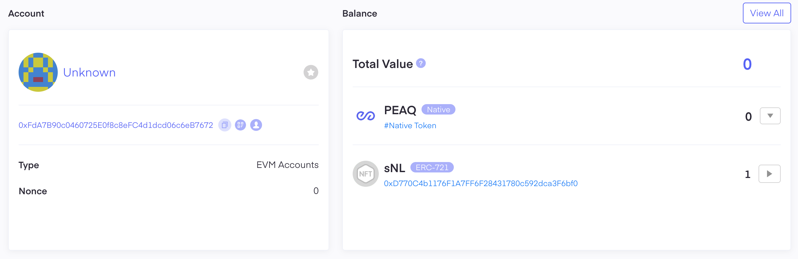

## Requirements

Before installing, you need to have:

1. **A [wallet](./faq.md#what-is-a-wallet) address (ERC-20 compatible)** - This is like a bank account number for digital money and also serves as your identity for participating in the DeNet network
2. **At least 100GB of free disk space** - Your computer needs room to store other people's data
3. **Operating system supported by DeNet** (see [Supported Platforms](../readme.md#supported-platforms) section)
4. [**PEAQ balance**](./faq.md#why-i-need-peaq-on-my-balance) - tokens are distributed to Datakeepers automatically and are being regularly credited for successfully completed transactions, if the node is running and does not disconnect from the network. If you balance is zero, please contact [support](https://discord.com/channels/920205740944273449/1341396814502559846)

## Step 0: Verify Your Account Has License

You need to prove you have permission to be a Datakeeper.

1. Go to https://peaq.subscan.io/account/YOUR_ADDRESS
2. Replace YOUR_ADDRESS with your actual wallet address (the long string of letters and numbers)
3. Look for "sNL ERC-721 token" - this shows you have a license

In the Subscan interface, you'll see details about your license:
- **Inventory For**: [starter] Datakeeper License
- **Token ID**: Your license ID
- **Owner**: Your wallet address

This ERC-721 token represents your right to operate a Datakeeper node on the DeNet network.

## Step 1: Copy Your [Private Key](./faq.md#what-is-a-private-key)

You need the private key from a wallet with a Datakeeper Node License.

### From DeNet App
1. Open the DeNet app
2. Go to "Profile" → "Settings" → "Security"
3. Copy the 64-character HEX private key (e.g., a1b2c3d4...)
4. Save it securely. Never share your private key!

### From Other Wallet (Example: Metamask)
1. Open Metamask in your browser or app
2. Select the account with the Datakeeper Node License
3. Go to "Account Details" → "Export Private Key"
4. Enter your Metamask password and copy the private key
5. **Store it securely! Do not share it anywhere!**

If you use any other wallet, the steps may differ but should be similar to the list above.

