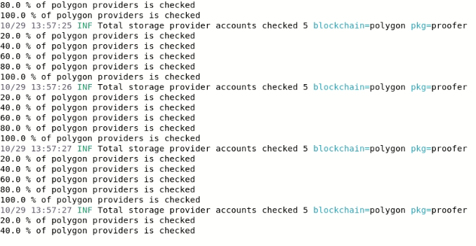

# [DeNet](https://denet.pro/en/) Node - CLI app for receiving rewards by sharing storage

[DeNet Node for Linux](https://github.com/cyb3rKn1ght/Node/releases/download/v1.0.0/denet-node-linux.tar.gz)

[DeNet Node for MacOS](https://github.com/cyb3rKn1ght/Node/releases/download/v1.0.0/denet-node-macOS.zip)

To use the app you need an account. The account is just an Ethereum wallet that you can import or create.

When you run the app it prompts you for password if you already have an account otherwise it runs the account import command.
If you run the app for the first time you need to setup the configuration. It's simple, all you need to do is to answer the question prompts.
Information about the IP address and port that you specified for remote connections will be added to a smart contract.

#### You will need two things:
#### - public IP address
#### - at least 0.1 MATIC on your Ethereum wallet that is going to be used as an account 

Having MATICs in your account wallet is also needed for paying transaction fees when sending file storage proofs, please top it up on time. DeNet smart contracts are deployed in Polygon. More networks will be added in the future.

You can run the app in the terminal emulator by navigating to the directory that contains the binary file and typing the following command: 

```bash
./denet-node
```

[Account import command demo](https://www.youtube.com/watch?v=vVRMHlqLA0w)

If you want to create a new account instead of importing an existing one just run the following command:

```bash
./denet-node account create
```

[Account create command demo](https://www.youtube.com/watch?v=So8VAjv9o1Y)

If you generated a new wallet when creating an account and need to receive the private key run the following command: 

```bash
./denet-node account export
```

[Account export command demo](https://www.youtube.com/watch?v=bnstbPGdjKY)

## Currently available commands cheat sheet

| Account Command | Description |
|---|---|
| account create | generates new Ethereum wallet that is used as an account |
| account import | imports Ethereum wallet by its private key |
| account export | discloses your private key |

## Minimal system requirements
- 1 GB of RAM 
- Public IP address and the ability to provide access for remote requests to the device
- 50GB of free storage space.
- 100% Uptime 
- OS: Linux or MacOS (Windows version will be released later)

## Useful info

[Permitting DeNet Node execution on MacOS ](https://www.youtube.com/watch?v=vw7yyDjyhS8)

## FAQ

### Is it ok to run DeNet Node on VPS?

Yes, but ....

If you already use a VPS it is ok to launch DeNet Node on it, but if launching the node is your only purpose, we recommend you try to launch it on your own machine instead of subscribing on a VPS. So if you have a PC or laptop with Linux or MacOS on board, you'll also need a public IP. It can be obtained via your ISP and is going to be cheaper than VPS.

### How much space should I share?

You can share as much as you can but sharing out more space will allow you to store more files and increases reward totals and your chances of being the first to receive it.

### Is my DeNet Node working properly?

When the start is successful you will see these messages in your terminal emulator


When your DeNet Node received files from users and started calculating if they can be used for receiving reward you will see this



Note if you don't see something similar for several days, please send as a message [here](https://discord.gg/cPz9m4cSWv) 

### How can I calculate my earnings?

When DeNet Node receives files it starts sending proofs to blockchain smart contract using Proof-Of-Storage algorithm

Nodes are rewarded in TBY tokens. One TBY can be received for storing 1 TB of data for a year. If you stored 500 GB for a year you will receive 0.5 TBY and so on. Our early miners will be additionally rewarded for every successful proof request. Also additional rewards for using miners resources are coming in the future.

##  Links

[Discord Miners Group](https://discord.gg/cPz9m4cSWv)

[DeNet - YouTube](https://www.youtube.com/channel/UCeCxt3tYbtSkJvaznNjQimQ)


