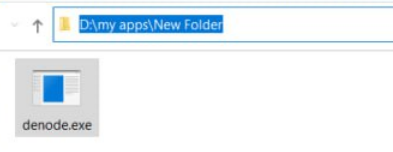
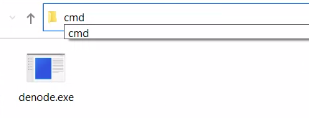
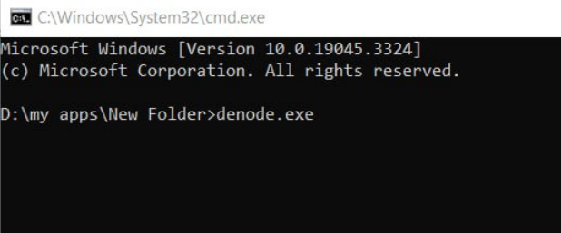
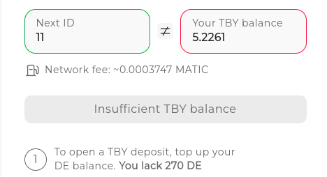
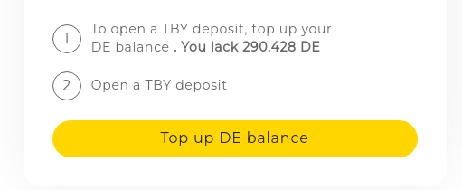
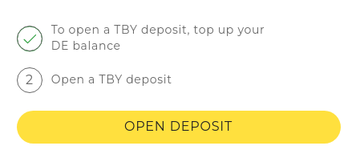
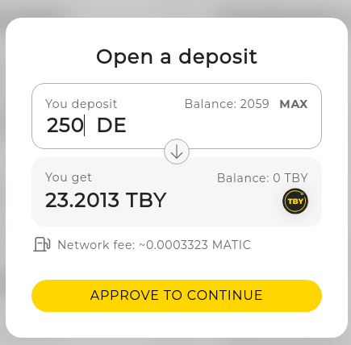

<p align="center">
    
</p>


<p align="center">
    Monetize your computer's storage now!
    <br/>
    <br/>
    <a href="https://denet.pro">
        
    </a> 
    <a href="https://t.me/+Yu5KnSruttc5ZGRi">
        
    </a> 
    <a href="https://discord.gg/cPz9m4cSWv">
        
    </a>
    <a href="https://www.youtube.com/channel/UCeCxt3tYbtSkJvaznNjQimQ">
        
    </a>
</p>

💽 **Datakeepers** offer their unused storage space to DeNet Storage users, creating a mutually beneficial conditions for all without any intermediaries. \
By utilizing the DeNet Storage Protocol, users pay for the storage they need, while Datakeepers are rewarded for the storage they provide.
#### 💰 [Calculate your potential reward](https://p.denet.app/datakeeper)

### Table of contents:
- [Requirements](#requirements)
- [Step 1: Installation](#step-1-installation)
    - [Windows](#windows)
    - [Linux](#linuxmacosarmv6)
    - [ARMv6](#linuxmacosarmv6)
    - [MacOS](#linuxmacosarmv6)
- [Step 2: Configuration](#step-2-configuration)
- [Step 3: Getting Datakeeper ID](#step-3-getting-datakeeper-id)
- [Send proofs](#send-proofs-and-earn-reward)
- [FAQ](#faq)


## Requirements
💡 **Make sure you meet all the requirements:**
- 1GB of RAM
- Public and static IP address
- Stable internet connection, with a minimum speed of **20Mbps**
- At least 0.1 Polygon MATIC (for sending proofs)
- Free disk space > 512G
- Operating Systems: Linux, MacOS, Windows (all x64)

## Step 1: Installation

### Windows

**1. Download latest release from [here](https://github.com/DeNetPRO/Node/releases/latest/download/denode-windows.zip)**

**2. Open containing folder, and extract archive to any location**

**3. Open that location using CMD**




**4. Run denode.exe using CMD**



-------------------
### Linux/MacOS/ARMv6

**1. Download binary using next command**

Using curl:
```
sh -c "$(curl -fsSL https://raw.githubusercontent.com/denetpro/node/master/scripts/install.sh)"
```
Using wget:
```
sh -c "$(wget  -O - https://raw.githubusercontent.com/denetpro/node/master/scripts/install.sh)"
```

**2. Launch denode binary**
```
denode
```
-------------------

## Step 2: Configuration

**Follow the instructions and configure your node:**
- Export Private key 
- Set the password to protect your private key
- Enter your public IP address – you can simply Google “whats my ip” to determine this
- Port **(press enter to use default)**
- Share disk (can be repeated with many disks)
    - Folder path of that you want to share
    - Size of the partition in GiB
- Choose the blockchain (currently only Polygon is supported)
    - Confirm selection of polygon **(press enter to use default)**
    - Select RPC – you can use a custom RPC or the default (https://polygon-rpc.com)

## Step 3: Getting Datakeeper ID

To be part of the network, you should get a Datakeeper ID.\
You will need DE [(0x081Ec4c0e30159C8259BAD8F4887f83010a681DC)](https://polygonscan.com/address/0x081ec4c0e30159c8259bad8f4887f83010a681dc) in order to open deposit of TBY [(0x1a9b54A3075119f1546C52cA0940551A6ce5d2D0)](https://polygonscan.com/address/0x1a9b54a3075119f1546c52ca0940551a6ce5d2d0) and get Datakeeper ID


1. Go to https://p.denet.app/datakeeper 

2. Connect your wallet from [step 1](#step-1-installation) (currently only [Metamask](https://metamask.io/) and Wallet Connect are supported), and be sure to switch to the Polygon network (chain 137).


3. Check that you have required amount of TBY to rent a Datakeeper ID.\
</br>

    If you don't have enough TBY and DE:
    1. Top up your DE balance (if you haven't)
</br>
</br>

   2. Convert DE to TBY (required TBY amount ≥ Dataeeper ID you'll get)
</br>
</br>


4. When you have enough TBY deposit, you now able to run node and lock your Datakeeper ID\
Relaunch your node and start getting files.

## Send proofs and earn reward: 

Wait for first files to be uploaded on your node.
Send your first proofs and earn $TBY and $TBYmined as a reward.

🪙 **Earn $TBYmined for sending proofs. Withdraw $TBYmined to $DE token**
- Use to influence protocol parameters at Consensus
- Use it for your own benefit

🪙 **Earn $TBY as a system reward from the protocol (2% APY of $TBY total supply)**
- Use it for storing data
- Soon: convert it to $TBYmined with charable proofs.

Go to [datakeeper page](https://p.denet.app/datakeeper). Login with your datakeeper account, and withdraw your TBY_Mined.

Ask your questions here and get help:

<a href="https://t.me/+Yu5KnSruttc5ZGRi">
    
</a> 
<a href="https://discord.gg/cPz9m4cSWv">
    
</a>

## FAQ 

### How do I calculate my potential earnings ❓

▪ Visit [datakeeper page](https://p.denet.app/datakeeper) and use calculator to estimate your potential income.

### How to see and withdraw my reward ❓

▪ Go to [datakeeper page](https://p.denet.app/datakeeper). Login with your datakeeper account, and withdraw your TBY_Mined.

### When will I start earning income ❓

▪ You will start earning TBY_Mined when files are uploaded to your node, and you send proof of storing these files based on the DeNet Proof-of-Storage algorithm.


### What is the purpose of getting a Datakeeper ID ❓

▪️ To become a Datakeeper and run a DeNode, you must make a TBY deposit equal to the ID you'll take up. The deposit improves network stability, enhances upload and download speeds, and provides a secure environment for all members. For more information, please refer to our [article](https://medium.com/denetpro/denet-storage-protocol-v3-to-address-key-challenge-of-decentralization-f19b9041b0fa).

### Why do I need TBY on my balance ❓
▪️ You can only send proofs and earn rewards if your TBY balance ≥ your Datakeeper ID.

### Will my deposit be spent when running a node ❓

▪️ No, the deposit amount remains the same and is only used to assert your ID.

### What can I do with my deposit if I want to leave ❓

▪️ Your deposit remains your property and can be withdrawn at any time. However, note that your ID may be taken by another member after you leave.
### Can I run DeNet Node on a VPS  ❓

▪️ Yes, it is possible to run DeNode on a VPS. However, we recommend running the node on your own machine if it is your only purpose. If you have a PC or laptop with Linux or MacOS, obtaining a public IP from your ISP will be cheaper than using a VPS.

### Do I need an SSD for my hard drive  ❓

▪️ There are no specific requirements for your hard drive, but faster I/O speed will allow you to store more files simultaneously and send proofs more often. Your hard drive must be in working condition without any damage.
