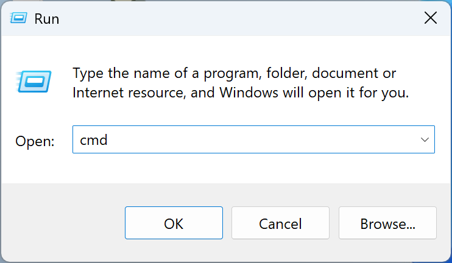
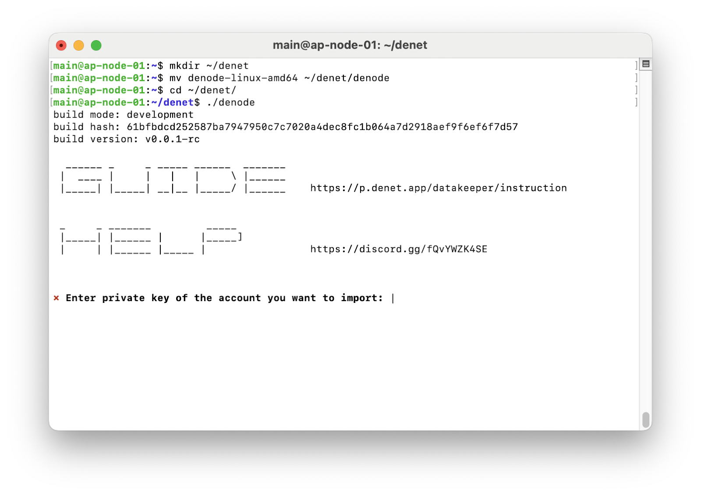
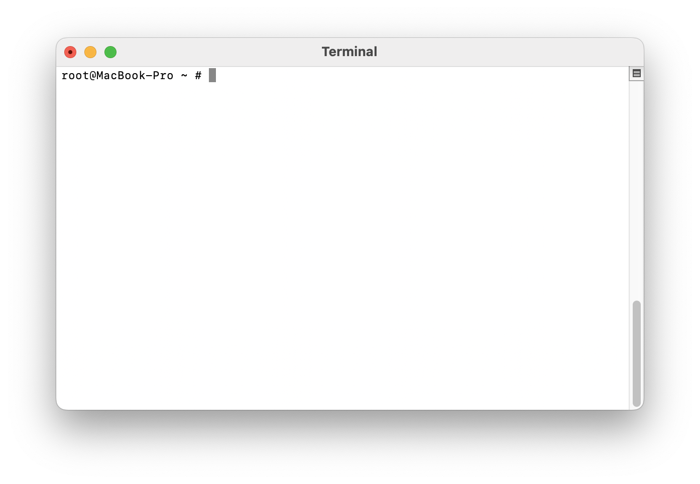

<p align="center">
    
</p>

<p align="center">
    Monetize your computer's storage now!
    <br/>
    <br/>
    <a href="https://denet.pro">
        
    </a> 
    <a href="https://t.me/+Yu5KnSruttc5ZGRi">
        
    </a> 
    <a href="https://discord.gg/cPz9m4cSWv">
        
    </a>
    <a href="https://www.youtube.com/channel/UCeCxt3tYbtSkJvaznNjQimQ">
        
    </a>
</p>

💽 **Datakeepers** offer their unused storage space to DeNet Storage users, creating a mutually beneficial conditions for all without any intermediaries. \
By utilizing the DeNet Storage Protocol, users pay for the storage they need, while Datakeepers are rewarded for the storage they provide.

# Becoming Datakeeper: node set up instruction

This guide walks you through setting up and running a DeNet Node, enabling your device to join the DeNet decentralized storage network

### Table of contents:

- [Requirements](#requirements)
- [Step 0: License Verification](#step-0-verify-your-account-has-license)
- [Step 1: Copy Private Key](#step-1-copy-your-private-key)
- [Step 2: Download Datakeeper Node](#step-2-download-datakeeper-node)
- [Step 3: Start Node](#step-3-start-denet-node)
  - [Windows](#windows)
  - [Linux](#linux)
  - [MacOS](#macos)
- [Step 4: Run DeNet Node](#step-4-run-denet-node)
- [Step 5: Monitor Transactions](#step-5-monitor-transactions)


## Requirements

  - A wallet address (DeNet app/Metamask/any other wallet) holding a Datakeeper Node License.
  - Device with free disk space for storing DeNet user data.
  - Terminal access (Command Prompt/PowerShell on Windows, Terminal on macOS/Linux).
  - DeNet Node application downloaded.
  - PEAQ balance: tokens will be distributed to Datakeepers automatically and will be regularly credited for successfully completed transactions, if the node is running and does not disconnect from the network, no deposits will be required.

## Step 0: Verify your account has license

  - Open https://peaq.subscan.io/account/YOUR_ADDRESS
  - Replace YOUR_ADDRESS with your wallet address.
  - The license(s) should be seen as a sNL ERC-721 token.


## Step 1: Copy Your Private Key
You need the private key from a wallet with a Datakeeper Node License.
### From DeNet App
1. Open the DeNet app.
2. Go to "Profile" -> "Settings"-> “Security”.
3. Copy the 64-character HEX private key (e.g., a1b2c3d4...).
4. Save it securely. Never share your private key!
### From other wallet (we take Metamask as an example)
1. Open Metamask in your browser or app.
2. Select the account with the Datakeeper Node License.
3. Go to "Account Details" > "Export Private Key."
4. Enter your Metamask password and copy the private key.
5. Store it securely. Do not share it!

_If you use any other wallet, the steps may differ but should be similar to the list above._

## Step 2: Download Datakeeper Node

1. Visit [https://github.com/DeNetPRO/Node/releases](https://github.com/DeNetPRO/Node/releases)
2. Download the latest application executable for your OS (Linux, macOS, or Windows)  
   
   **macOS**: use amd64 for Intel hardware, arm64 for Apple Silicon.

3. Copy application to another directory.  
   **Example:**   
   - macOS/Linux: copy denode executable to `~/denet/` directory  
   - Windows: copy to `C:\denet\` directory

## Step 3: Start DeNet Node
Launch the node via a terminal.

### Windows
1. Open Terminal: Press **Win + R**, type cmd or powershell, and press Enter.
   
2. Start the Application: 
- Navigate to the Application Folder
   
- Run application executable
   
### Linux
1. Open Terminal: Use Ctrl + Alt + T or your terminal shortcut.
   Or SSH to your remote host.
2. Start the Application: Navigate to the Application Folder and Run application executable
   

### MacOS
1. Open "Terminal" via Spotlight or Applications  
   
   
2. Start the Application: same as for Linux systems 
NOTE: you may need “xattr -d com.apple.quarantine denode” to allow executable
   

## Step 4: Run DeNet Node
1. **Enter private key**: Paste the copied private key and press Enter.  
- The key is stored securely on your device, encrypted with this password.

2. **Set Password**: Enter a strong password
- The private key is encrypted with the password.

3. **Choose Port**: Press Enter for the default one
- Or specify another (value from 10000 to 65535)
4. **Specify Storage Directory**: Enter path to the user files storage
- **e.g.**, /home/user/denet_storage (Linux/macOS) or C:\denet_storage (Windows). 
- Ensure the directory exists and has sufficient space.
5. **Set Storage Space**:
- Specify the amount of disk space to allocate for DeNet Storage (e.g., 10). Enter the value (only number, without GiB) when prompted.
7. **Optional Second Drive**: Enter 'N' to skip.
- Or if you want to use another drive, provide its path when prompted.
8. **Select RPC for peaq Blockchain**: Press Enter to use default one.
- Or choose the RPC endpoint (Select RPC for peaq (ChainID: 3338)).
9. **Verify Operation**: 
- Watch the terminal output. If no errors appear, your DeNet Node is running correctly.
   

## Step 5: Monitor Transactions

Track your node’s activity using the peaq Subscan web interface.
1. Visit the peaq Subscan website (e.g., https://peaq.subscan.io/account/YOUR_ADDRESS).
  - Search for your node’s transactions using your Datakeeper address.
2. Check transaction statuses. Green check marks indicate successful transactions, confirming your node is working correctly.
   
## Troubleshooting

- **Errors in Terminal**: Carefully check error message. Most of the errors are related to the lack of Internet, insufficient balance of gas tokens, or the result of manually changing the data generated by the node. Ask for help from community members or contact support in Discord.
- **Failed Transactions in Subscan**: There may be some unusual situations where transactions fail. If you encounter such cases, please open a support ticket.
  
- **Port Conflicts**: If port 55050 is in use, try another port (e.g., 55051)
  
- **Subscan Issues:** If transactions don’t appear, confirm your node is running and has enough gas tokens (> 0.03 $PEAQ).
## Notes
- Keep your terminal open to maintain the node’s operation. Closing it stops the node. Otherwise, set up the node as a background service (see [Advanced Settings: Systemd Service](#advanced-settings)).
- Additional steps (e.g., advanced settings) will be added as needed — check for updates from DeNet.

Congratulations, Datakeeper! Your DeNet Node is now contributing to the decentralized storage network.

A graphical user interface (GUI) for seamless node operation coming soon. Stay tuned!

## Advanced Settings:

#### Systemd service (Linux)
- It is recommended to run as non-root user.
- Follow [Step 4](#step-4-run-denet-node) first. You should have config files in the path
  You should have config files in the path `/home/denet/.denode/`
- We used **denet** user as an example, replace it with your username.

**/etc/systemd/system/denode.service**
```ini
[Unit]
Description=DeNode Service
After=network.target

[Service]
User=denet
Group=denet
Type=simple
ExecStart=/usr/local/bin/denode
EnvironmentFile=/home/denet/denode.env
Restart=always
RestartSec=5
```
**/home/denet/denode.env**
```text
DENODE_PASSWORD='your password'
```

Run the following commands to enable startup and run node
```shell
sudo systemctl daemon-reload
sudo systemctl enable denode.service
sudo systemctl start denode.service
```
Now your node will be running and start at boot.

**View latest logs**
`journalctl -u denode -r`


#### Ask your questions here and get help:

<a href="https://discord.gg/cPz9m4cSWv">
    
</a>

